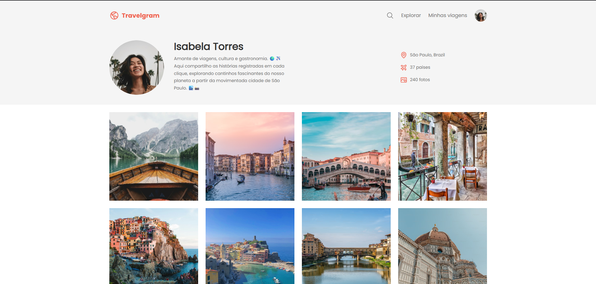

# ✈️ Travelgram

**Página de perfil de viagens** inspirada em redes sociais como Instagram, onde usuários podem compartilhar suas aventuras ao redor do mundo. O projeto apresenta um perfil completo com foto, bio, localização, estatísticas de viagem e uma galeria de fotos das jornadas realizadas.

## 📸 Preview

 

## 🚀 Demonstração

🔗 [Acesse o site](https://rochacode08.github.io/Travelgram/)

## 🛠️ Tecnologias utilizadas

- **HTML5** — estruturação semântica da página
- **CSS3** — estilização com **Flexbox**, variáveis CSS e CSS Nesting
- **Google Fonts** — tipografia com a fonte *Poppins*

## ✨ Funcionalidades

- ✅ **Barra de navegação** com logo, busca, links e avatar do usuário
- ✅ **Seção de perfil** com foto, nome, biografia e estatísticas
- ✅ **Informações do usuário**: localização 📍, países visitados ✈️ e fotos 📸
- ✅ **Galeria de fotos** de viagens em layout de grid flexível
- ✅ **Rodapé** com copyright, termos de uso e política de privacidade
- ✅ **Totalmente responsivo** com 3 breakpoints inteligentes
- ✅ **Arquitetura CSS modular** com arquivos separados por seção
- ✅ Uso de **CSS Custom Properties** para tipografia e cores

## 🎨 Paleta de cores

Paleta minimalista com destaque em laranja/coral:

| Cor                    | Hex         |
| ---------------------- | ----------- |
| 🟠 Brand (Coral)       | `#EF5F4C`   |
| ⚪ Background           | `#FFFFFF`   |
| ⬜ Surface              | `#F5F5F5`   |
| 🔘 Skeleton            | `#D9D9D9`   |
| ⚫ Texto Primário       | `#313131`   |
| 🔘 Texto Secundário    | `#6C6C6C`   |

## 📂 Estrutura do projeto

```
📦 travelgram
 ┣ 📂 assets
 ┃ ┣ 📂 icons          → Ícones SVG (lupa, avião, mapa, imagem)
 ┃ ┣ 📂 images         → Fotos da galeria de viagens
 ┃ ┣ 🖼️ Logo.svg
 ┃ ┗ 🖼️ Profile pic.png
 ┣ 📂 styles
 ┃ ┣ 📜 index.css       → Arquivo principal que importa os demais
 ┃ ┣ 📜 global.css      → Reset, variáveis e estilos globais
 ┃ ┣ 📜 nav.css         → Estilos da barra de navegação
 ┃ ┣ 📜 header.css      → Estilos do cabeçalho com o perfil
 ┃ ┣ 📜 main.css        → Estilos da galeria de fotos
 ┃ ┗ 📜 footer.css      → Estilos do rodapé
 ┗ 📜 index.html         → Página principal
```

## 📱 Responsividade

O projeto conta com **3 breakpoints** estrategicamente posicionados:

| Dispositivo       | Largura máxima | Principais ajustes                              |
| ----------------- | -------------- | ----------------------------------------------- |
| 💻 Tablet         | até 768px      | Header empilha perfil e info em coluna          |
| 📱 Tablet pequeno | até 600px      | Link "Minhas viagens" é ocultado do menu        |
| 📱 Mobile         | até 425px      | Foto e texto do perfil se empilham              |

> 🆕 Uso da **sintaxe moderna de range queries** (`width <= 768px`) em vez da antiga `max-width`, seguindo as tendências atuais do CSS.

## 💻 Como rodar o projeto

Clone o repositório:

```bash
git clone https://github.com/rochacode08/Travelgram.git
```

Acesse a pasta do projeto:

```bash
cd Travelgram
```

Abra o arquivo `index.html` no navegador — ou utilize a extensão **Live Server** do VS Code para recarregamento automático.

## 📚 O que eu aprendi

Este projeto me ajudou a consolidar e explorar conceitos importantes de CSS moderno:

- Estruturação semântica com HTML5 (`<nav>`, `<header>`, `<main>`, `<footer>`)
- **Flexbox** avançado com `justify-content`, `align-items` e `flex-wrap`
- **CSS Custom Properties** para criar um *design system* consistente
- Shorthand da propriedade `font` para definir tudo de uma vez
- **CSS Nesting** nativo (selectors aninhados sem pré-processador)
- Organização de CSS em **arquivos modulares** com `@import`
- Uso do seletor `:nth-child()` para estilizar elementos específicos
- **Sintaxe moderna de range queries** em media queries (`width <= 600px`)
- Uso de unidades `rem` para escalabilidade e acessibilidade
- Imagens circulares com `border-radius: 50%` e `object-fit: cover`
- Técnicas de responsividade progressiva (*mobile-first thinking*)
- Debugging de overflow horizontal e suas causas

## 🔮 Melhorias futuras

- [ ] Adicionar lightbox/modal para visualizar fotos em tamanho maior
- [ ] Implementar sistema de curtidas e comentários em cada foto
- [ ] Criar página individual para cada foto da galeria
- [ ] Adicionar funcionalidade real ao botão de busca
- [ ] Implementar menu hamburguer no mobile
- [ ] Criar página de cadastro e login
- [ ] Integrar com API para upload real de fotos
- [ ] Adicionar mapa interativo mostrando países visitados

## 📝 Licença

Este projeto foi desenvolvido apenas para fins **educacionais e de estudo**.

---

## 👨‍💻 Autor
Desenvolvido com 💙 por **[Gabriel Rocha Lopes](https://github.com/rochacode08)**

<a href="mailto:gabrielrocha.devstack@gmail.com">
    
</a>
<a href="https://www.linkedin.com/in/gabriel-rocha-devstack">
    
</a>
<a href="https://www.instagram.com/gabriel_lopess15/">
    
</a>

---
